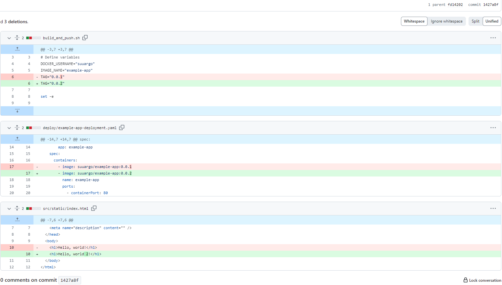

# ArgoCD
## Prerequisites
- terraform
- kubectl
- aws-cli
- argocd

## Running
### Kubernetes setup
1. Store AWS credentials and config in ~/.aws/
2. `terraform init`
3. `terraform apply`
4. Check the cluster's name: `aws eks list-clusters `
5. Generate kubeconfig: `aws eks update-kubeconfig --name <your cluster>`
6. Verify connection via kubectl: `kubectl get nodes`

### ArgoCD setup
1. Create namespace: `kubectl create namespace argocd`
2. Install ArgoCD: `kubectl apply -n argocd -f https://raw.githubusercontent.com/argoproj/argo-cd/stable/manifests/install.yaml`
3. Make Argo API accessible from the local machine (makes the terminal busy): `kubectl port-forward svc/argocd-server -n argocd 8080:443`
4. Access Argo API via web browser: [localhost:8080](https://localhost:8080)
5. Obtain the password: `argocd admin initial-password -n argocd`
6. Login: `argocd login localhost:8080 --username admin --password <password>`

### Create application from Git repository
1. Set namespace: `kubectl config set-context --current --namespace=argocd`
2. Create sample application: `argocd app create example-app --repo https://github.com/SUU-Argo/argocd-example-app.git --path deploy --dest-server https://kubernetes.default.svc --dest-namespace default`
3. Describe application instance: `argocd app get example-app`, the initial status is `OutOfSync`
4. Sync application with the Git repository (one time): `argocd app sync example-app`

5. Autosync: `argocd app set example-app --sync-policy automated`
6. Make application accessible from the local machine (makes the terminal busy): `kubectl port-forward svc/example-app -n default 8081:8080`
7. Validate accessibility via web browser

### Test sync
Changes will be synced only if there are changes in the `--path` directory (in this case it's `deploy`). \
Even if code is modified and an image is built in order to be synced it requires a new tag (avoid tagging with latest).

1. Modify source of app
2. Build a new version and push it to DockerHub. [This script](https://github.com/SUU-Argo/argocd-example-app/blob/main/build_and_push.sh) can be used but the `TAG` variable shall be updated
3. Modify the image version in the deployment file
4. Make desired changes in deployment files
5. Push changes to the Git repostiory
6. Changes should be auto synced

#### Modification commit

#### Argo view after pushing the commit
Pay attention to the commit hash

#### Modified app
Change in code is reflected

## Sources
- https://developer.hashicorp.com/terraform/tutorials/kubernetes/eks
- https://github.com/hashicorp/learn-terraform-provision-eks-cluster
- https://argo-cd.readthedocs.io/en/stable/getting_started/
